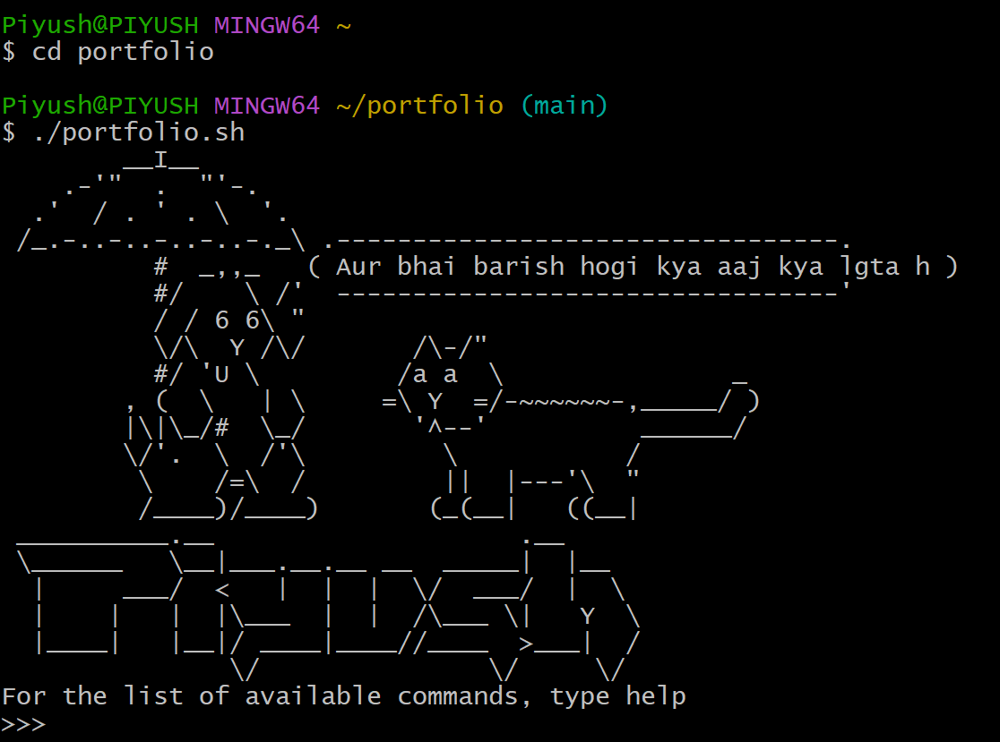

# TerminalPortfolio
This project is my portfolio in CLI. This is bash script which contains my portfolio which you can access using the basic bash commands.

Usage details : 
- Clone the repository
- Run `chmod 755` for this script
- Then run using `./portfolio.sh`